---
## Front matter
title: "Отчёта по лабораторной работе 6"
subtitle: "Основы работы с Midnight Commander (mc). Структура программы на языке ассемблера NASM"
author: "Еюбоглу Тимур	НПИбд-01-22"

## Generic otions
lang: ru-RU
toc-title: "Содержание"

## Bibliography
bibliography: bib/cite.bib
csl: pandoc/csl/gost-r-7-0-5-2008-numeric.csl

## Pdf output format
toc: true # Table of contents
toc-depth: 2
lof: true # List of figures
lot: true # List of tables
fontsize: 12pt
linestretch: 1.5
papersize: a4
documentclass: scrreprt
## I18n polyglossia
polyglossia-lang:
  name: russian
  options:
	- spelling=modern
	- babelshorthands=true
polyglossia-otherlangs:
  name: english
## I18n babel
babel-lang: russian
babel-otherlangs: english
## Fonts
mainfont: PT Serif
romanfont: PT Serif
sansfont: PT Sans
monofont: PT Mono
mainfontoptions: Ligatures=TeX
romanfontoptions: Ligatures=TeX
sansfontoptions: Ligatures=TeX,Scale=MatchLowercase
monofontoptions: Scale=MatchLowercase,Scale=0.9
## Biblatex
biblatex: true
biblio-style: "gost-numeric"
biblatexoptions:
  - parentracker=true
  - backend=biber
  - hyperref=auto
  - language=auto
  - autolang=other*
  - citestyle=gost-numeric
## Pandoc-crossref LaTeX customization
figureTitle: "Рис."
tableTitle: "Таблица"
listingTitle: "Листинг"
lofTitle: "Список иллюстраций"
lotTitle: "Список таблиц"
lolTitle: "Листинги"
## Misc options
indent: true
header-includes:
  - \usepackage{indentfirst}
  - \usepackage{float} # keep figures where there are in the text
  - \floatplacement{figure}{H} # keep figures where there are in the text
---

# Цель работы

Целью работы является приобретение практических навыков работы в Midnight Commander. 
Освоение инструкций языка ассемблера mov и int.

# Задание

1. Изучите как работать в Midnight Commander.

2. Изучите примеры программ из задания к работе.

3. Дополните примеры в соответсвии с заданием.

4. Загрузите файлы на GitHub.

# Теоретическое введение

Midnight Commander (или просто mc) — это программа, которая позволяет просматривать структуру 
каталогов и выполнять основные операции по управлению файловой системой, 
т.е. mc является файловым менеджером. 
Midnight Commander позволяет сделать работу с файлами более удобной и наглядной.

Программа на языке ассемблера NASM, как правило, состоит из трёх секций: 
секция кода программы (SECTION .text), секция инициированных (известных во время компиляции) 
данных (SECTION .data) и секция неинициализированных данных 
(тех, под которые во время компиляции только отводится память,
а значение присваивается в ходе выполнения программы) (SECTION .bss).

# Выполнение лабораторной работы

1. Создадим  новый подкаталог с именем lab06 и в нем файл lab6-1.asm. (рис. [-@fig:001])

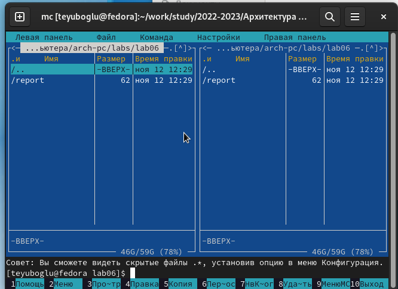{ #fig:001 width=70%, height=70% }

2. Введем в файл lab6-1.asm текст программы вывода сообщения на экран и 
ввода строки с клавиатуры (Листинг 1.). 
Создадим исполняемый файл и проверим его работу. (рис. [-@fig:002], [-@fig:003])

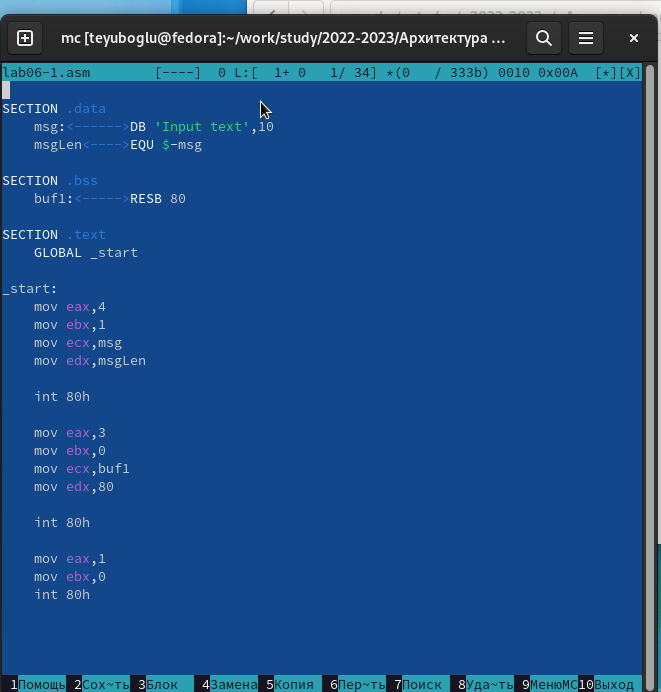{ #fig:002 width=70%, height=70% }

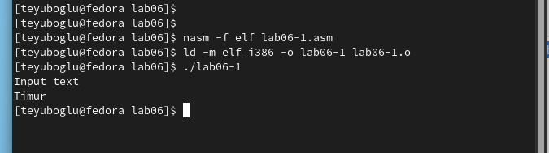{ #fig:003 width=70%, height=70% }

3. Скачали с туис доп файл, скопировали программу. (рис. [-@fig:004])

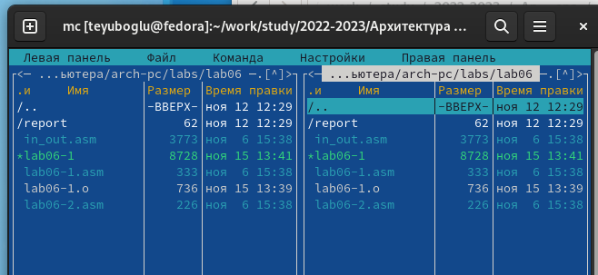{ #fig:004 width=70%, height=70% }

4. Изменили код программы. (рис. [-@fig:005], [-@fig:006])

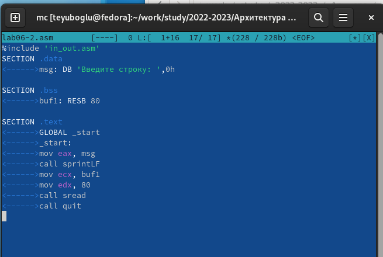{ #fig:005 width=70%, height=70% }

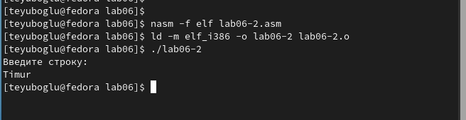{ #fig:006 width=70%, height=70% }

5. Изменили вызов подпрограммы. Теперь ввод и вывод в одну строку. (рис. [-@fig:007], [-@fig:008])

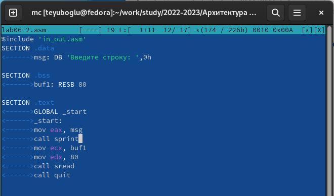{ #fig:007 width=70%, height=70% }

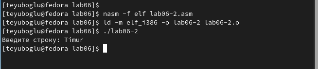{ #fig:008 width=70%, height=70% }

6.	Внесем изменения в программу (без использования внешнего файла in_out.asm), 
так чтобы она работала по следующему алгоритму:  (рис. [-@fig:009], [-@fig:010])

* вывести приглашение типа “Введите строку:”;

* ввести строку с клавиатуры;

* вывести введённую строку на экран.

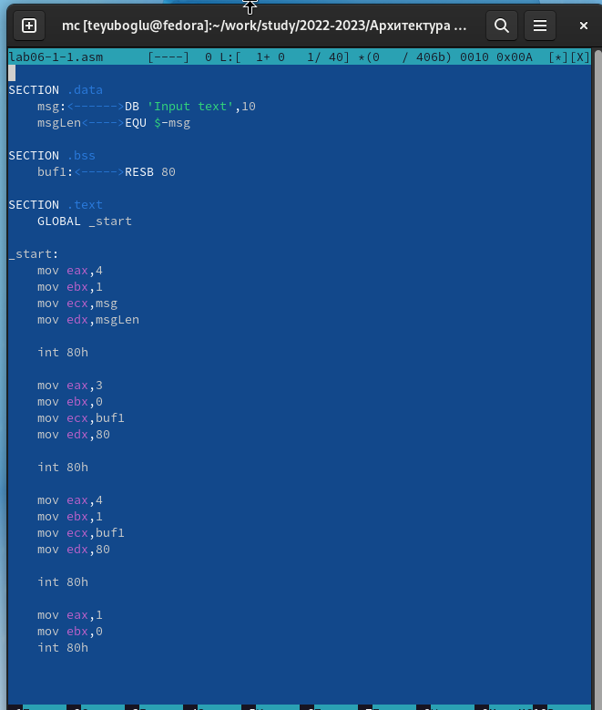{ #fig:009 width=70%, height=70% }

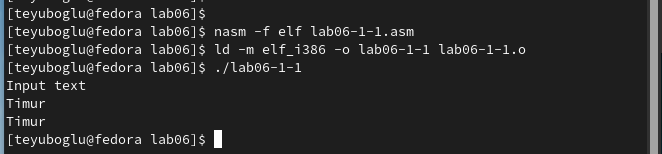{ #fig:010 width=70%, height=70% }

7. Сделаем тоже самое с файлом in_out.asm (рис. [-@fig:011], [-@fig:012])

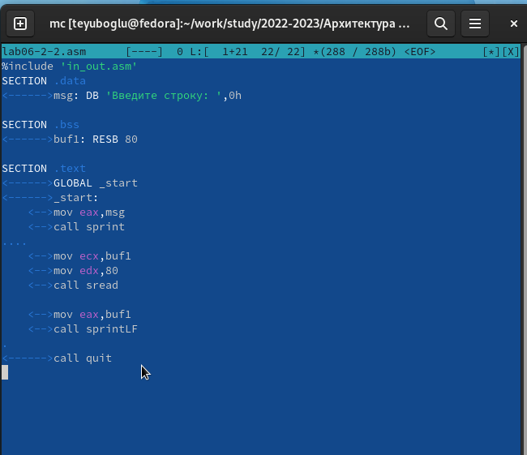{ #fig:011 width=70%, height=70% }

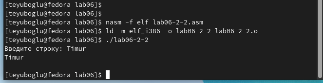{ #fig:012 width=70%, height=70% }

# Выводы

Научились писать базовые ассемблерные программы. Освоили ассемблерные инструкции mov и int.

# Список литературы{.unnumbered}

1. [Расширенный ассемблер: NASM](https://www.opennet.ru/docs/RUS/nasm/)
2. [MASM, TASM, FASM, NASM под Windows и Linux](https://habr.com/ru/post/326078/)
